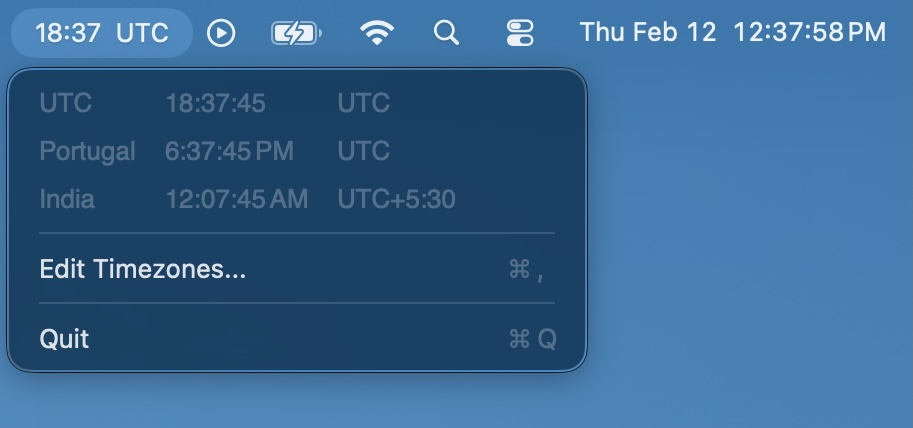

# Timezone Bar

A lightweight macOS menu bar app that shows world clocks at a glance. Click the menu bar to see all your configured timezones with aligned columns, or display a specific timezone's time right in the menu bar.



## Features

- **Menu bar clock** -- show local time, a specific timezone, or just an icon
- **Configurable timezone list** -- add any timezone, reorder by drag-and-drop
- **Per-timezone settings** -- each timezone gets its own time format (12h/24h/system) and label style (city, abbreviation, UTC offset, or both)
- **Nicknames** -- give any timezone a custom name (e.g. "Office" instead of "Kolkata")
- **Local time row** -- optionally include your local time in the dropdown
- **Launch at login** -- via SMAppService (requires the .app bundle)
- **No Dock icon** -- runs as a menu bar-only app

Requires macOS 14+.

## Install

### From release

Download the DMG from the [latest release](../../releases/latest), open it, and drag **Timezone Bar.app** to `/Applications`.

### From source

```
git clone https://github.com/mathew-cf/menubar-timezones.git
cd menubar-timezones
make install
```

This builds a release binary, bundles it into a `.app`, and copies it to `/Applications`.

## Build

```
make build      # release build
make bundle     # build + create .app bundle in build/
make test       # run tests
make run        # bundle + open the app
make clean      # remove build artifacts
```

Or use Swift Package Manager directly:

```
swift build
swift test
```

## Configuration

Open preferences with **Cmd+,** (or click **Edit Timezones...** in the dropdown).

### Timezones tab

- Add/remove/reorder timezones
- Select a timezone to configure its time format, label style, and nickname
- Toggle **Include local time** to show/hide a local time row in the dropdown

### General tab

- **Launch at login**
- **Menu bar shows** -- local time, icon only, or a specific configured timezone
- **Show seconds**
- **Label next to time** -- none, city name, abbreviation, or UTC offset

## Project structure

```
Sources/TimezoneBar/
  main.swift                 # NSApplication bootstrap
  AppDelegate.swift          # creates StatusBarController on launch
  TimezoneManager.swift      # data model, settings, time formatting
  StatusBarController.swift  # NSStatusItem, NSMenu, timer
  PreferencesWindow.swift    # SwiftUI preferences (Timezones + General tabs)
  TimezonePickerView.swift   # searchable timezone picker sheet
  LoginItemManager.swift     # SMAppService wrapper

Tests/TimezoneBarTests/
  HelperTests.swift           # cityName, utcOffsetString, normalizedAbbreviation
  TimezoneManagerTests.swift  # CRUD, persistence, formatting, components
  AppSettingsTests.swift      # defaults, Codable, display names, equality
```

## License

MIT
